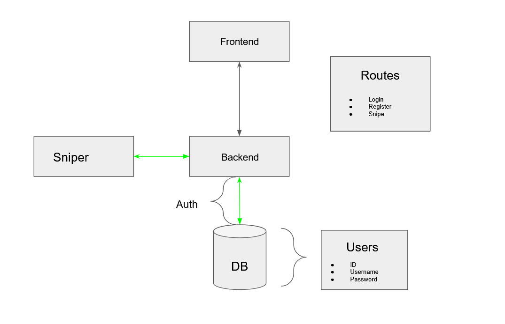

# BSC Sniper Bot

## Overview

The idea here is to create a liquidity pool sniper on bsc (for now) as a service as I haven't seen this type of service in the crypto space yet. To truly be a service, this means I will likely have to store a users private key on the database (v2), so the emphasis will be on security on the backend, while also providing warnings and best practices for safety for users on the frontend.

V1 is meant to be a pilot for testing and personal use only. V2 will abstract the service.

## TODO:
- Sniper integration
- Python start script

-- v2 --
- Schema update (priv-key)
- Registration Module
- Password / PK Encryption
- Frontend ``/snipe`` route guard

## Development Info
- Webserver start command - ``npm run start``
- Anuglar start command - ``ng serve``
- Database start command - ``docker-compose up -d``

### Stack
- Nest.js (Express)
- Typescript
- Angular
- Docker
- Postgres